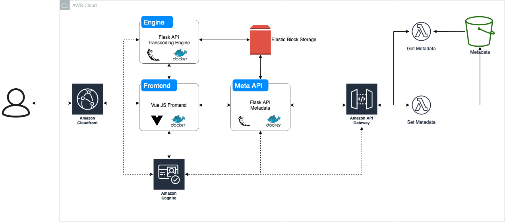

# Flair

Flair is a video streaming platform.

## Flair Engine

Flair Engine is the work-horse of the platform. It transcodes videos to stream form
on the go using FFMPEG library.

## Flair Frontend

Flair Frontend is the frontend for the platform, it is written in Vue.JS.
This should contain all the frontend for users, administrating and uploads.
The video is being rendered with the help of HTML5 video element.

## Flair Meta API

Flair Meta API is an API which returns the metadata about different media.
This performs tasks such as getting the length of the videos, creating/retrieving a
frame snapshot of the video and other metadata.

## Flair Storage

Flair Storage is an elastic block storage used to store the media.

## Architecture

Here is the proposed overview of the architecture.

